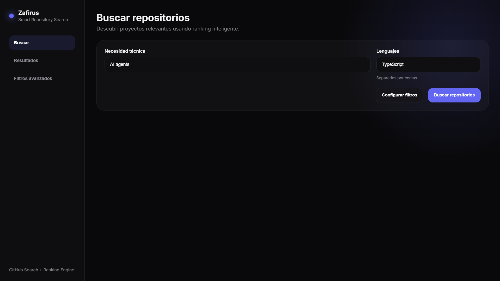
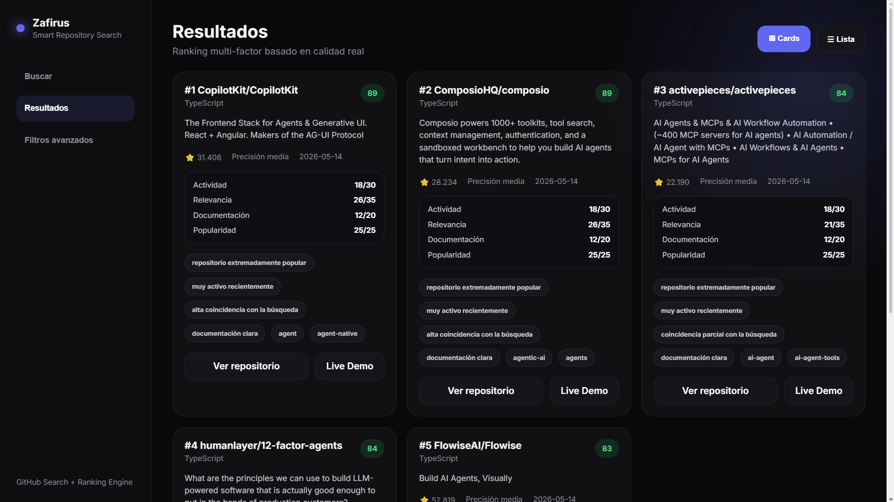
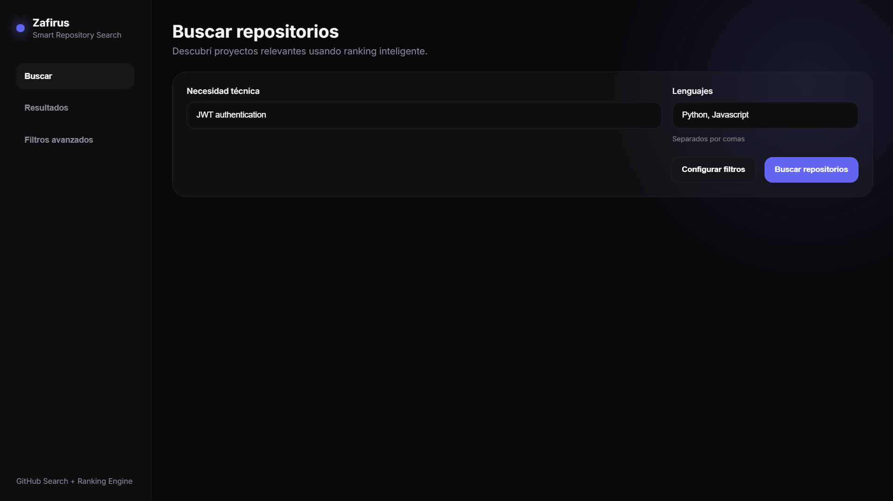
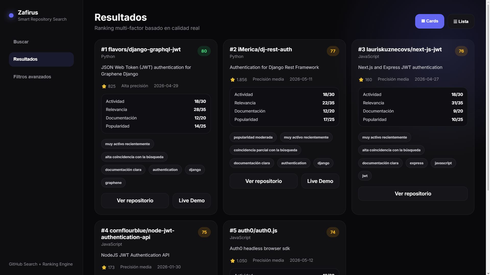
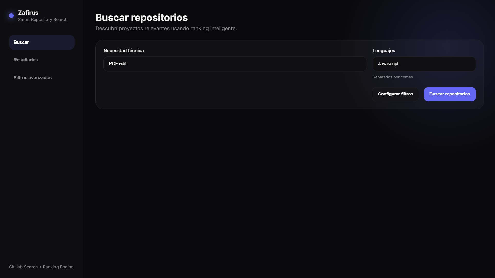
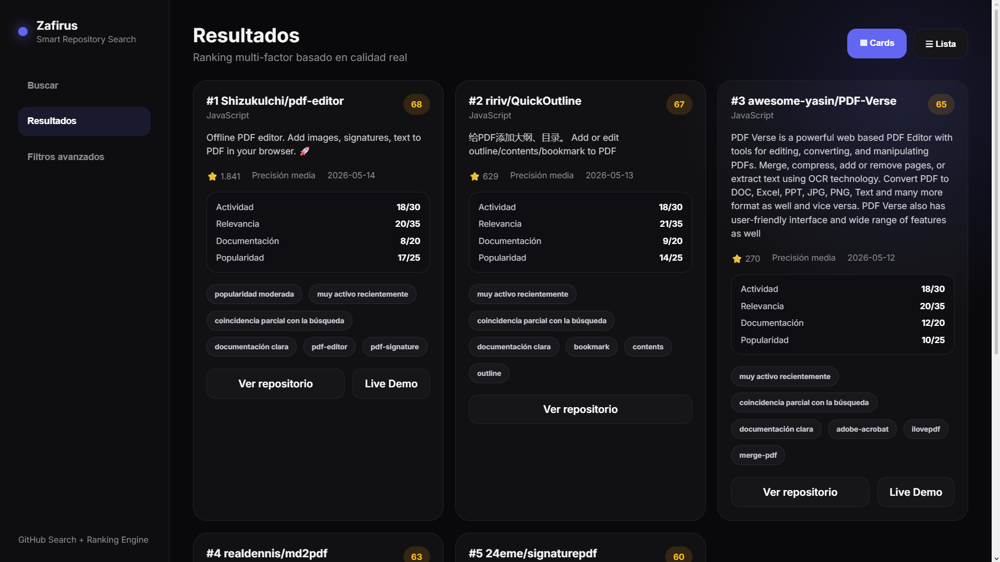

# Zafirus Smart Repository Search

Buscador inteligente de repositorios GitHub construido con **FastAPI + JavaScript**.

El sistema recibe una necesidad técnica y devuelve los repositorios más relevantes y útiles usando un motor de ranking propio basado en:

- actividad reciente
- relevancia con la búsqueda
- calidad de documentación
- popularidad
- mantenimiento real

El objetivo del proyecto no es mostrar simplemente los repositorios más populares de GitHub, sino construir una capa inteligente capaz de recomendar proyectos realmente útiles para equipos de desarrollo.

---

# Demo visual

## Search View 1



---

## Results View 1



## Search View 2



---

## Results View 2



## Search View 3



---

## Results View 3



---

# Features

- Smart repository ranking
- Multi-factor scoring engine
- Query expansion system
- Repository quality detection
- Activity-based ranking
- Fork analysis
- Confidence system
- Automatic explanations
- REST API architecture
- Responsive frontend
- Modular backend
- Transparent scoring philosophy

---

# Filosofía del proyecto

El sistema fue diseñado con una filosofía clara:

> Priorizar repositorios útiles, mantenidos y relevantes para equipos de desarrollo reales, en lugar de depender únicamente de popularidad o cantidad de stars.

El enfoque del proyecto prioriza:

- simplicidad
- claridad
- modularidad
- mantenibilidad
- explicabilidad
- decisiones defendibles técnicamente

Se evitó intencionalmente:

- overengineering
- IA innecesariamente compleja
- embeddings
- bases de datos
- features artificiales solo para aparentar complejidad

---

# Arquitectura

## Flujo general

```text
Frontend
   ↓
FastAPI REST API
   ↓
GitHub Search API
   ↓
Motor de ranking interno
   ↓
Top repositories recomendados
```

---

## Flujo interno del backend

```text
Input del usuario
   ↓
Query Builder
   ↓
GitHub Search
   ↓
Filtrado
   ↓
Scoring
   ↓
Ranking
   ↓
Respuesta JSON
```

---

# Estructura del backend

```text
backend/
│
├── api/
│   └── routes.py
│
├── filters/
│   └── repo_filters.py
│
├── models/
│   └── repository.py
│
├── scoring/
│   ├── scorer.py
│   └── weights.py
│
├── services/
│   ├── github_service.py
│   ├── query_builder.py
│   └── query_expander.py
│
├── utils/
│   ├── explanation.py
│   └── helpers.py
│
├── main.py
├── requirements.txt
└── .env.example
```

---

# Responsabilidades de cada módulo

## `github_service.py`

- comunicación con GitHub API
- manejo de rate limits
- parseo de resultados
- ranking final

---

## `query_builder.py`

- construcción del query para GitHub Search API

---

## `query_expander.py`

- expansión inteligente de keywords relacionadas

---

## `scorer.py`

- núcleo del ranking multi-factor

---

## `repo_filters.py`

- filtrado de repositorios irrelevantes o de baja calidad

---

## `explanation.py`

- generación automática de explicaciones del ranking

---

# Stack tecnológico

## Backend

- Python
- FastAPI
- Pydantic
- Requests

---

## Frontend

- HTML
- CSS
- Vanilla JavaScript

---

## APIs

- GitHub Search API

---

# Sistema de scoring

El sistema utiliza un ranking multi-factor basado en señales reales de calidad y mantenimiento.

## Distribución de pesos

| Factor | Peso |
|---|---|
| Actividad reciente | 35% |
| Relevancia | 25% |
| Documentación | 20% |
| Popularidad | 20% |

---

# Señales utilizadas

## Popularidad

Se evalúa mediante:

- stars
- adopción
- confianza social
- comunidad

Pero las stars NO dominan automáticamente el ranking.

---

## Actividad reciente

Se analiza:

- tiempo desde la última actualización
- mantenimiento reciente
- actividad real del proyecto

Un repositorio extremadamente popular pero abandonado puede perder posiciones.

---

## Relevancia

Se evalúa mediante:

- coincidencia con keywords
- nombre del repo
- descripción
- topics

---

## Calidad de documentación

Se analiza:

- descripción
- topics
- homepage
- señales de buena documentación

---

# Penalizaciones

El sistema penaliza:

| Penalización | Valor |
|---|---|
| Repositorio archivado | -30 |
| Inactividad extrema | -10 |
| Repositorio low quality | -10 |
| Fork irrelevante | -5 |

---

# Bonificaciones

| Bonus | Valor |
|---|---|
| Fork relevante y mantenido | +10 |

---

# Expansión de queries

El sistema expande automáticamente ciertas búsquedas para mejorar relevancia.

## Ejemplo

Input:

```text
auth
```

Expanded terms:

```text
authentication
authorization
jwt
oauth
security
```

---

# Sistema de confianza

Cada repositorio recibe un nivel de confianza:

- High
- Medium
- Low

Basado en:

- actividad
- relevancia
- documentación
- popularidad

---

# Detección de repositorios low quality

El sistema intenta detectar repositorios de baja calidad usando heurísticas simples.

Ejemplos de términos penalizados:

- tutorial
- demo
- example
- starter
- template
- boilerplate

---

# Frontend

La interfaz fue diseñada con foco en:

- claridad
- simplicidad
- experiencia visual moderna
- transparencia del ranking

## UI Features

- glassmorphism
- responsive layout
- cards/list modes
- loading states
- confidence indicators
- score colors

---

# Filtros avanzados

La interfaz incluye un sistema visual de filtros avanzados y sliders de configuración del ranking.

Actualmente funcionan como una representación conceptual de futuras mejoras del sistema y todavía no modifican directamente la lógica del backend.

Filtros incluidos:

- minimum stars
- maximum inactive days
- exclude archived repositories
- exclude low quality repositories
- exclude forks

---

# API

## Endpoint

```http
POST /search
```

---

## Request

```json
{
  "query": "JWT authentication",
  "languages": ["Python"]
}
```

---

## Response

```json
{
  "repositories": [
    {
      "rank": 1,
      "name": "PyJWT",
      "score": 87,
      "confidence": "high",
      "reasons": [
        "alta popularidad",
        "muy activo recientemente",
        "alta coincidencia con la búsqueda"
      ]
    }
  ]
}
```

---

# Instalación y ejecución

## 1. Clonar repositorio

```bash
git clone https://github.com/Damnger024/zafirus-repository-search.git
```

---

## 2. Entrar al proyecto

```bash
cd zafirus-repository-search
```

---

# Backend

## 3. Entrar a la carpeta backend

```bash
cd backend
```

---

## 4. Crear entorno virtual

### Windows

```bash
python -m venv venv
```

### Linux / Mac

```bash
python3 -m venv venv
```

---

## 5. Activar entorno virtual

### Windows

```bash
venv\Scripts\activate
```

### Linux / Mac

```bash
source venv/bin/activate
```

---

## 6. Instalar dependencias

```bash
pip install -r requirements.txt
```

---

## 7. Crear archivo `.env`

Crear un archivo llamado:

```text
.env
```

dentro de:

```text
backend/
```

---

## 8. Configurar GitHub Token

Dentro del `.env` agregar:

```env
GITHUB_TOKEN=your_github_token
```

---

## ¿Por qué se necesita un token?

GitHub limita fuertemente las requests anónimas.

Usar un token permite:

- aumentar rate limits
- evitar bloqueos rápidos
- mejorar estabilidad del sistema

---

## ¿Cómo obtener un token?

1. Ir a GitHub
2. Settings
3. Developer settings
4. Personal access tokens
5. Generate new token

No se requieren permisos especiales para este proyecto.

---

## 9. Ejecutar backend

```bash
uvicorn main:app --reload
```

Backend disponible en:

```text
http://127.0.0.1:8000
```

---

## 10. Swagger Docs

FastAPI genera documentación automática en:

```text
http://127.0.0.1:8000/docs
```

---

# Frontend

## 11. Abrir frontend

Abrir:

```text
frontend/index.html
```

---

# Ejemplos de búsquedas

## JWT Authentication — Python

Posibles resultados destacados:

- PyJWT
- FastAPI Users
- Authlib

---

## AI Agents — TypeScript

Posibles resultados destacados:

- LangChainJS
- AutoGen
- OpenDevin

---

## Database ORM — Go

Posibles resultados destacados:

- GORM
- SQLX
- Ent

---

# Decisiones de ingeniería

## ¿Por qué FastAPI?

Se eligió FastAPI por:

- arquitectura limpia
- ecosistema moderno de Python
- excelente integración con APIs
- modularidad sencilla
- ideal para lógica de scoring y ranking

---

## ¿Por qué Vanilla JavaScript en lugar de React?

React fue evitado intencionalmente porque:

- agregaba complejidad innecesaria
- el frontend no era el núcleo del challenge
- el foco principal debía mantenerse en el motor de ranking

---

## ¿Por qué no usar base de datos?

Se decidió no usar base de datos porque:

- GitHub ya actúa como fuente de datos
- no era necesaria persistencia
- evitaba complejidad innecesaria

---

## ¿Por qué no usar IA compleja o embeddings?

El proyecto prioriza:

- explicabilidad
- transparencia
- decisiones defendibles técnicamente

en lugar de depender de sistemas opacos de ranking generados por IA.

---

# Manejo de rate limits

El backend maneja límites de GitHub API mediante:

- autenticación con GitHub token
- detección de rate limits
- respuestas informativas
- control básico de requests

---

# Limitaciones actuales

- el sistema solo analiza candidatos devueltos por GitHub Search
- la expansión de queries es rule-based
- no existe capa de caching
- no se utilizan embeddings semánticos
- el ranking es heurístico
- los filtros avanzados del frontend todavía son conceptuales

---

# Mejoras futuras

- Redis caching
- requests async
- semantic search
- embeddings
- mejor NLP para queries
- métricas más avanzadas de salud del repositorio
- perfiles personalizados de ranking
- análisis histórico de repositorios

---

# Testing

El sistema fue probado usando:

- Swagger (`/docs`)
- Postman
- integración frontend/backend

---

# Escalabilidad

Si el sistema creciera para soportar equipos grandes:

- se podría agregar caching
- procesamiento async
- almacenamiento temporal
- indexado propio
- análisis incremental de repositorios

La arquitectura modular actual facilita esa evolución.

---

# Conclusión

Zafirus Smart Repository Search fue diseñado como:

> una capa inteligente sobre GitHub Search API.

El foco principal del proyecto fue construir un sistema:

- modular
- transparente
- mantenible
- defendible
- pragmático

Priorizando:

- calidad real
- mantenimiento activo
- relevancia técnica
- criterio de ingeniería práctico

por encima de métricas superficiales como únicamente stars o popularidad.